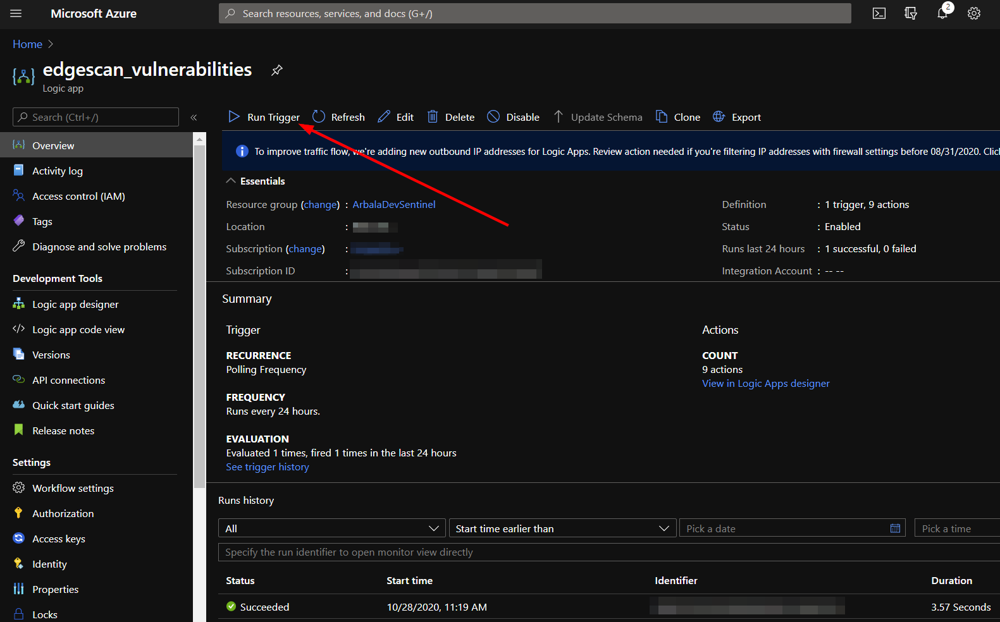

# Edegscan-AzureSentinel-Integration

## Functionality
This package contains three separate logic apps:
* **edgescan_vulnerabilities**
* **edgescan_assets**
* **edgescan_hosts**

The logic apps are set to run daily and to ingest records created in Edgescan over the past two days. 
  
**Note** In the case of hosts, since no created date field appears to exist, the field indicating the last update is used instead.
  
The logic apps will scan the entries created within the last 7 days in the **custom logs** in Azure Sentinel for IDs duplicate IDs before adding a new entry to the corresponding log.

Entries will be stored in Azure Sentinel **custom logs** with the following table names:
* **edgescan_vulnerabilities_CL**
* **edgescan_assets_CL**
* **edgescan_hosts_CL**

### Viewing Custom Logs
* From your home page, navigate to the Azure Sentinel service
* There, select the workspace your deployed logic apps reference
* There, click on Logs in the left-hand menu and expand Custom Logs

## Deploy the Logic Apps

## Usage
For initial runs, the URI in the GET request should be modified, removing every character after the question mark.
Be sure to while first a copy of the original URI.

By running the logic app without the conditional constraints, all existing vulnerability, host, and asset records in Edgescan will be integrated into Azure Sentinel.
To do this, enable each logic app and run their triggers.

Once this is done, restore the URIs in each logic app to their original text.

If you do not wish to have constant polling of assets and hosts, these logic apps may be disabled again.

